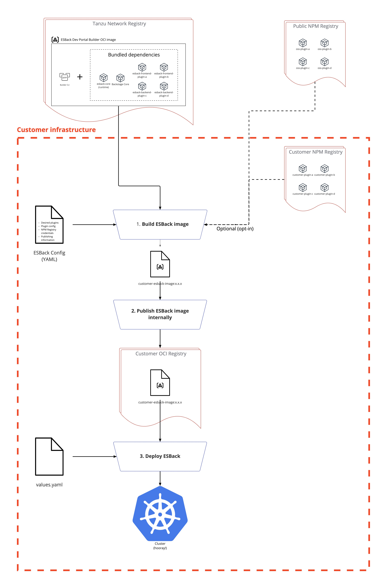

# Onboarding

This document describes resources to get you familiar with working and building the ESBack project. It is meant to evolve along with the project. If you find any outdate information, or something you found useful during your onboarding that is not included here, please feel free to update the doc.

## Relevant Reading

[Backstage Enterprise Support Strategy Review](https://docs.google.com/document/d/1QxMhHVxsPnMXBCJQgE9_U0oXKjzyScLqm7B1lyEP8qw/edit) - Start here. It’s a high-level overview of the business objectives

[Taxonomy of core ESBack terminology](https://docs.google.com/document/d/1x8_1eq8yyBzwq4r_twzPzI3pdDPrqWkh3c1xs9Ya8Uc/edit)

[Enterprise Supported Backstage Architecture Review](https://docs.google.com/document/d/1jBpTVpg8ABavhVUzDKTri-LbdNE4pLpxQRtljMEDC84/edit) - High-level review of the project architecture

[Miro board with detailed architecture](https://miro.com/app/board/uXjVOpj4AGc=/?moveToWidget=3458764533901823314&cot=14)

[Delivery plan](https://docs.google.com/presentation/d/1mBADhpKO4zCcegbfLJRIoes-763eF80cCyDzYWI_DaA/edit#slide=id.p1) - Sequence of the high-level work items we’ll be tackling, with milestone definitions and commentary on staffing.

[Enterprise Supported Backstage Confluence page](https://confluence.eng.vmware.com/display/CNA/Enterprise+Supported+Backstage)

## Architecture Diagram

For more detailed architecture diagrams check our [Miro board](https://miro.com/app/board/uXjVOpj4AGc=/?moveToWidget=3458764533901823314&cot=14).


## Relevant tools and access

Confirm you have access to the following tools:

- [The Gitlab esback group](https://gitlab.eng.vmware.com/esback), and all the projects contained within (Builder, Core, Decisions, Foundation, Plugins, and Tools)
- [Our Runway pipeline](https://runway-ci-sfo.eng.vmware.com/)
- [Our Runway vault instance](https://runway-vault-sfo.eng.vmware.com/ui/vault/secrets/runway_concourse/list/esback/)
- [Esback project in Harbor](https://harbor-repo.vmware.com/harbor/projects/3358050/repositories)
- [Artifactory](https://artifactory.eng.vmware.com/ui/repos/tree/General/esback-npm-local) - it is public to view, but you will need permissions to push to it

## Things to Try

### Vanilla Backstage

Get familiar with [Backstage](https://backstage.io/).
Try [setting up and running Backstage](https://backstage.io/docs/getting-started/).
One of the main pain points ESBack attempts to resolve is the manual process of adding plugins to Backstage.
To feel some of this pain consider going through the Backstage [Plugin Development Guide](https://backstage.io/docs/plugins/plugin-development) and the [Adding Custom Plugin to Existing Monorepo App](https://backstage.io/docs/tutorials/quickstart-app-plugin) tutorial.

### Build a Backstage instance using the builder cli

The builder cli is a tool for producing custom templated instances of Backstage.
It can be found in our [tools repo](https://gitlab.eng.vmware.com/esback/tools/-/tree/main/), in the [bootstrap directory](https://gitlab.eng.vmware.com/esback/tools/-/tree/main/bootstrap).

Follow the instructions for building a Backstage instance using the cli [here](https://gitlab.eng.vmware.com/esback/tools/-/blob/main/README.md#build-a-backstage-instance-using-the-builder-cli).

### Build a Backstage instance using Cloud Native Buildpacks

The builder image is an OCI image containing the builder cli and dependencies. The image contains everything that we provide for building a custom instance of Backstage, including plugins that we officially support. This is how customers will consume ESBack. For a detailed diagram refer to our [Miro board](https://miro.com/app/board/uXjVOpj4AGc=/).

We use a custom [Cloud Native Buildpack](https://buildpacks.io/) defined in the buildpacks directory to build and output a runnable OCI image containing your custom instance of Backstage.

The docker file for the builder image can be found in [here](https://gitlab.eng.vmware.com/esback/tools/-/blob/main/Dockerfile).

The flow is described in the tools repo [README](https://gitlab.eng.vmware.com/esback/tools/-/blob/main/README.md).

Follow the instructions [found here](https://gitlab.eng.vmware.com/esback/tools/-/blob/main/README.md#running-locally) to build the image.

### Build the Builder Image

Follow the steps in the tools repo README under the [Making Changes](https://gitlab.eng.vmware.com/esback/tools/-/blob/main/README.md#making-changes) section.

### Build a custom ESBack plugin

An ESBack plugin is a thin wrapper for a Backstage plugin.
It exports an instance of the AppPluginInterface or BackendPluginInterface in `src/index.ts` depending on the type of plugin.
You can see a sample of a frontend ESBack plugin in `plugins/esback-hello-world`.

To build an ESBack plugin, follow [these steps](https://gitlab.eng.vmware.com/esback/core/-/blob/main/plugins/README.md#build-a-custom-esback-plugin).

### Contributing

We have `make` commands that wrap most of the commands we are using in our everyday work. It is not required to use them and you can use `yarn` scripts instead if you prefer and when it is possible.

If you are using the `make` commands, you can also benefit from the autocompletion to avoid typing the whole command.

#### Merge/Pull Requests

All changes should be put on a branch and submitted as a merge request in GitLab.

#### Running the application

To start the application in development mode:

```shell
make start
```

The equivalent `yarn` commands are:

```shell
yarn install
yarn dev
```

#### Building

To build the whole thing:

```shell
make build
```

or even shorter:

```shell
make
```

This command will clean the distribution folders, install the dependencies, compile the code and generate the build.

The equivalent `yarn` commands are:

```shell
yarn clean
yarn install
yarn tsc
yarn build
```

##### Compiling

To compile the typescript code, run:

```shell
make compile
```

The equivalent `yarn` command is:

```shell
yarn tsc
```

#### Linting

To check for linting errors run:

```shell
make lint
```

The equivalent `yarn` command is:

```shell
yarn lint:all
```

To fix lint errors run:

```shell
make fix-lint
```

The equivalent `yarn` command is:

```shell
yarn lint:all --fix
```

Not all lint errors can be fixed with this command: sometimes, you will have to fix them manually.

To check for formatting errors run:

```shell
make check-prettier
```

The equivalent `yarn` command is:

```shell
yarn prettier:check
```

If there are formatting issues run:

```shell
make prettier
```

The equivalent `yarn` command is:

```shell
yarn prettify
```

If you have already committed everything (no unstaged changes) and you are running the linter before pushing, you can use the following:

```shell
make prettier && git add . && git commit --amend --no-edit
```

#### Testing

To run the unit tests:

```shell
make test
```

The equivalent `yarn` command is:

```shell
yarn test:all
```

To run the integration tests, please refer to [this document](./packages/app/cypress/README.md).

#### CI

A [slack channel](https://vmware.slack.com/archives/C04TDJATVPS) is dedicated to the pipelines failures. Please be sure to be invited to it so that you can be notified of errors.

If your build fails or hangs:

1.  Go to your merge request in GitLab and make note of your merge request id (found in the url as well as on the page).

2.  Go to [the resource view on Concourse](https://runway-ci-sfo.eng.vmware.com/teams/esback/pipelines/mr-check/resources/gitlab-mr).

3.  Find your merge request id in the list and expand it.
    All the jobs for your merge request should appear and the failing job(s) should be immediately apparent.

4.  Click on the failing job to drill down and view the errors/failures.

##### Common CI failures

Occasionally the build will fail due to network issues, or other flaky reasons.
If the build fails for one of these reasons, retrigger the build.

1.  Failure to push an image to harbor with 401 response.

#### Updating the pipeline

If you are working on updating our pipeline, you might want to create your own to avoid pausing or breaking the existing one specially if you are doing heavy changes.

Here is one way of how to do it:

1. First, comment out the sections that might conflict with the existing pipeline

This is ususally one or more of these sections:

- the reconfigure section if you want to avoid auto-reconfiguration of our pipelines during your tests

```yaml
- name: reconfigure
  plan:
    - get: esback-core
      trigger: true
#      - set_pipeline: self
#        file: esback-core/ci/pipeline.yml
#        vars:
#          git_branch: ((git_branch))
#          initial_version: ((initial_version))
#      - set_pipeline: mr-check
#        file: esback-core/ci/mr-check.yml
#        vars:
#          initial_version: ((initial_version))
```

- the deployment in the dev environment

```yaml
- name: update-dev-env
  plan:
    - get: code
      resource: esback-core
      passed: [build]
      trigger: true
#      - task: write-kubeconfig-file
#        file: code/ci/write-kubeconfig-file.yml
#        vars:
#          kubeconfig: ((calatrava-env-dev.kubeconfig))
#      - task: restart-k8s-deployment
#        file: code/ci/restart-k8s-deployment.yml
```

- the publication of new artefacts in our Artifactory

```yaml
- name: publish
  plan:
    - in_parallel:
        - get: code
          resource: esback-core
          passed: [integration-tests]
          trigger: true
        - do:
            - get: version
              passed: [build]
            - load_var: version
              file: version/version
              reveal: true
#      - task: yarn-build
#        file: code/ci/yarn-build.yml
#      - task: lerna-publish
#        file: code/ci/publish.yml
#        vars:
#          git_branch: ((git_branch))
#      - put: esback-core
#        params:
#          repository: code
#          tag: version/version
#          only_tag: true
```

Of course, if you are working on updating on of these sections, you might not comment them.

2. Switch to the branch used to implement your updates: **do not remain on the `main` branch**.

3. Then, you can use the following command to create a new pipeline:

```shell
make create-pipeline name=esback-123
```

4. Once you're done with your pipeline, you can delete it with this command:

```shell
make descroy-pipeline name=esback-123
```
