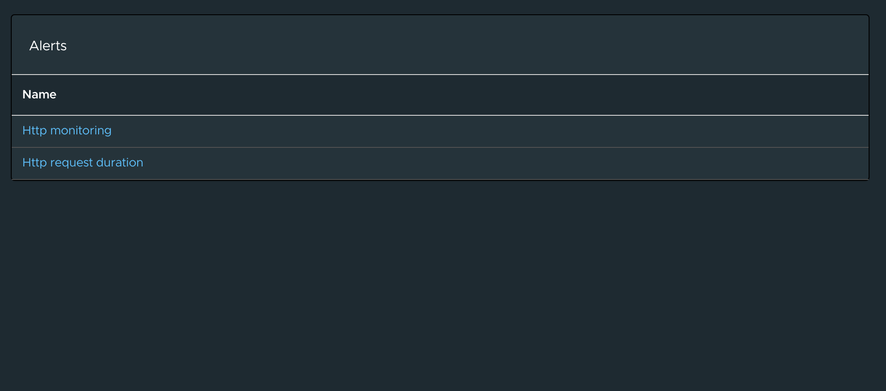
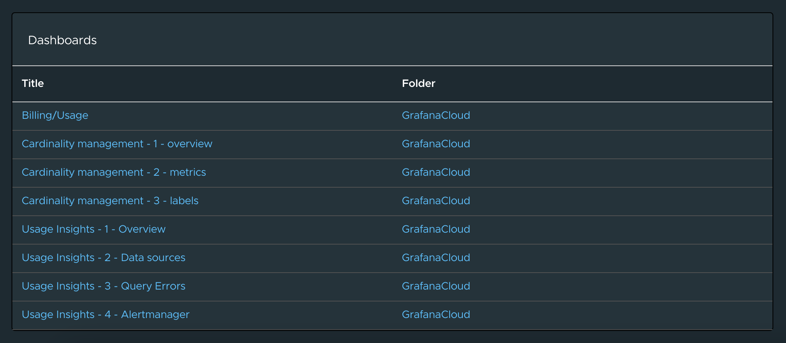
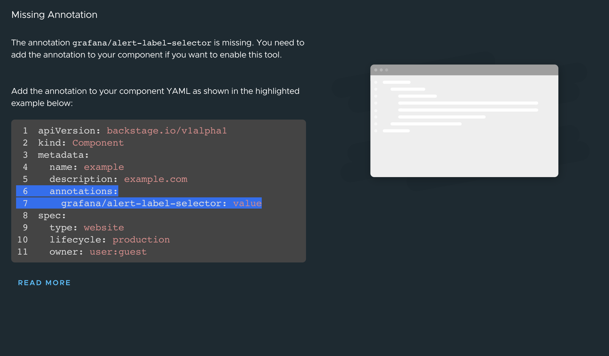
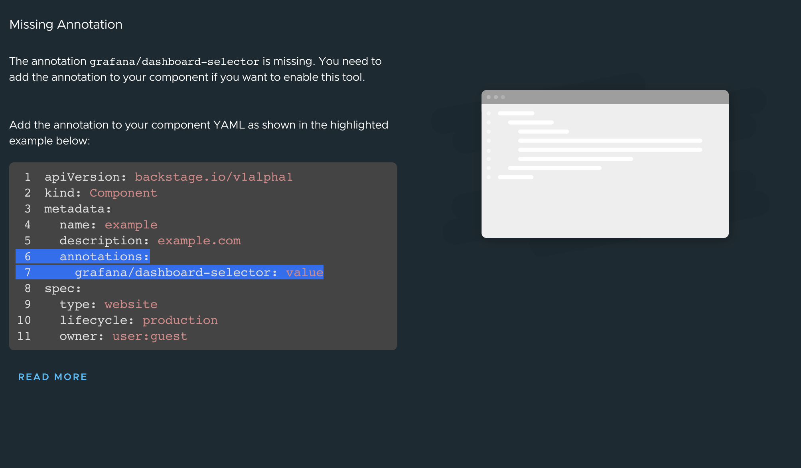

# Tanzu Portal Builder (TPB) Wrapper for Backstage Grafana plugin

This plugin wraps the Backstage Grafana plugin which renders the Alerts and Dashboard Card in the Component's overview tab.

The result looks similar to this:




## Plugin Wrapper Overview

This wrapper uses the concept of [Surfaces](https://gitlab.eng.vmware.com/esback/core#frontend-plugins) to incorporate the Grafana plugin into TPB.

What follows is a technical explanation of how this wrapping is done using the Surfaces APIs.

### Plugin Boilerplate

Let's create our plugin folder structure by making a copy of the [tpb-hello-world plugin](../tpb-hello-world/) and modifying its contents.
Dont' forget to modify the `package.json` file to reflect the name and version of your wrapper. For this example we've used `@tpb/plugin-backstage-grafana` to keep the pattern used by other plugins.

### Defining an `AppPluginInterface`

In order for TPB to pick up the plugin we need to create a definition of type `AppPluginInterface` which is defined by the `@tpb/core-frontend` package. This package should already be included in your dependencies if you created the boilerplate following the instructions above.

This definition is a high-order-function that returns a function that takes in as parameter the `SurfaceStoreInterface`; this `SurfaceStoreInterface` will be then used to _apply_ the dependencies to the specified surfaces.

A barebones definition of a TPB wrapper plugin may look like the following:

```
export const PluginDefinition: AppPluginInterface = () => context: SurfaceStoreInterface => {
  context.apply(
    SurfaceToUse
    (surfaceToUse) => {
      surfaceToUse.add(element)
    },
  );
};

```

where `context` is of type `SurfaceStoreInterface`; `SurfaceToUse` is any subtype of `TpbSurface`, and the passed function is called a `SurfaceModifier` which is where you can interact with the surfaces instances and add different stuff to them.
In the above example we are calling the method `add` to pass an `element` which is a `ReactElement`.

There are scenarios in which more surfaces need to be manipulated in order to integrate the plugin —such as this wrapper— and for those use cases the `SurfaceStoreInterface` exposes the method `applyWithDependency` in which it is possible to pass several `SurfaceConstructor` dependencies which will be then made available to the `SurfaceModifier` function as parameters.

## `AppPluginInterface` for Grafana

Now let's take a look at how we can use all of the things that we've just described above to wrap the Grafana plugin into TPB.

First, let's start by looking at our actual implementation of the `AppPluginInterface` definition.

```
import { EntitySwitch } from '@backstage/plugin-catalog';
import {
  EntityGrafanaAlertsCard,
  EntityGrafanaDashboardsCard,
} from '@k-phoen/backstage-plugin-grafana';
import { Grid } from '@material-ui/core';
import { AppPluginInterface, AppRouteSurface } from '@tpb/core-frontend';
import { EntityPageSurface } from '@tpb/plugin-catalog';
import React from 'react';

export const BackstageGrafanaPlugin: AppPluginInterface = () => context => {
  context.applyWithDependency(
    AppRouteSurface,
    EntityPageSurface,
    (_, surface) => {
      surface.addOverviewContent(
        <Grid item md={7} xs={12}>
          <EntityGrafanaAlertsCard />
        </Grid>,
      );
      surface.addOverviewContent(
        <Grid item md={7} xs={12}>
          <EntityGrafanaDashboardsCard />
        </Grid>,
      );
    },
  );
};


```

Let's analyze it:

`BackstageGrafanaPlugin` is the main exportable part — the `AppPluginInterface` definition; it returns a function that receives a parameter we called `context` which is a `SurfaceStoreInterface`.

Then the function `applyWithDependency` is invoked from the `context` with two TPB Surfaces: `AppRouteSurface` and `EntityPageSurface`.

At this point you may be wondering: how do we know which surfaces are needed?
The answer is that it depends on the parts of the application that you want to modify. For this particular scenario we see in the [Grafana Plugin for Backstage Documentation](https://github.com/K-Phoen/backstage-plugin-grafana/blob/main/README.md) that adding an `EntityGrafanaAlertsCard` and `EntityGrafanaDashboardsCard` requires modifying the `EntityPage` — specifically adding it to the Overview content. So we require the `EntityPageSurface` so that we can add stuff to it.

A comprehensive list of the available surfaces can be found [here](../../README.md) — However, do note that as the platform expands in features new surfaces will be made available and other plugins may also expose surfaces to use (such as in this case, where we obtain the `EntityPageSurface` from the `@tpb/plugin-catalog` package — don't forget to install it as a dependency: `yarn add @tpb/plugin-catalog`).

After figuring out our surfaces and installing the necessary dependencies for them, the last parameter that `applyWithDependency` receives is the `SurfaceModifier` function. This is where actual instances of the surfaces are provided to us in order to interact with them. In the example above we are calling the `addOverviewContent` of the `EntityPageSurface` with a `ReactElement` being passed as parameter to the function.
This `ReactElement` consists of an `EntityGrafanaAlertsCard` and an `EntityGrafanaDashboardsCard` from Grafana plugin. Don't forget to install it: `yarn add '@k-phoen/backstage-plugin-grafana'`.

The final part in creating our TPB plugin wrapper is exporting it. We do that in our [package's main](./src/index.ts):

```
export { BackstageGrafanaPlugin as plugin } from './BackstageGrafanaPlugin';

```

We _strongly_ suggest exporting your `AppPluginInterface` aliased as `plugin`, just like shown above, to keep your wrapper consistent with the pattern used in other existing TPB wrappers.

## Build and publish the package.

Now the only thing left to do with the wrapper is to package and publish it.

First, remember to verify the version defined in the [package.json](./package.json); then, from the folder of the plugin, run `yarn install` to install all dependencies, then run `yarn tsc` to verify that the typescript code compiles properly, and finally run `yarn build` to package it all.

Once all the above commands have been executed succesfully you should publish the package to any compatible registry by using `npm publish --registry="<<YOUR REGISTRY URL>"`.
Please refer to the [TPB Plugins documentation](../README.md) for considerations about the registries used to publish our packages.

And that's it. You now have a published TPB wrapper for Grafana plugin for Backstage.

## Integrate the package into your TPB instance

Refer to the [TPB Plugins main documentation](../README.md) for detailed instructions on how to integrate any published TPB wrapper into your running instance.

## Configuration

Add the below configuration to the `app-config.yaml` to connect to a particular Grafana instance.

##### Config

```yaml
proxy:
  '/grafana/api':
    # May be a public or an internal DNS
    target: https://test.grafana.net/
    headers:
      Authorization: 'Bearer ${GRAFANA_TOKEN}'

grafana:
  # Publicly accessible domain
  domain: https://test.grafana.net/
  # Is unified alerting enabled in Grafana?
  # See: https://grafana.com/blog/2021/06/14/the-new-unified-alerting-system-for-grafana-everything-you-need-to-know/
  # Optional. Default: false
  unifiedAlerting: true
```

And add the `annotations` entry for Grafana to the catalog entity to display the grafana alerts and dashboard lists on the component overview tab.

##### Catalog

```yaml
apiVersion: backstage.io/v1alpha1
kind: Component
metadata:
  name: grafana-example
  description: An example for Grafana integration.
  annotations:
    grafana/dashboard-selector: 'general'
    grafana/alert-label-selector: 'type=http-requests'
```

If the annotations for the alert and dashboard is not configured, then the card will be rendered as below:



More detailed explanation for Grafana configuration is available [here](https://github.com/K-Phoen/backstage-plugin-grafana/blob/main/README.md).
