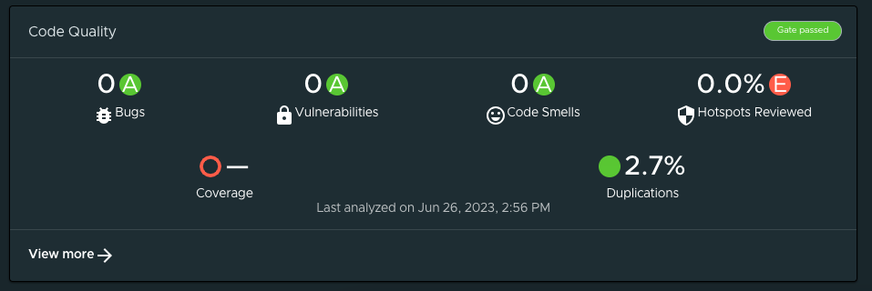

# Tanzu Portal Builder (TPB) Wrapper for Backstage Sonarqube Backend plugin

The code in this plugin wraps the default backend for Backstage's Sonarqube plugin.

Used in conjunction with the [Frontend wrapper](../tpb-backstage-sonarqube) it brings Sonarqube's default functionalities into TPB. The end result looks similar to this:



## Plugin Wrapper Overview

This wrapper uses the concept of [Surfaces](../../README.md#backend-plugins) to incorporate the Sonarqube backend plugin into TPB.

What follows is a technical explanation of how this wrapping is done using the Surfaces APIs.

### Plugin Boilerplate

Let's create our plugin folder structure by making a copy of the [tpb-hello-world-backend plugin](../tpb-hello-world-backend/) and modifying its contents.
Dont' forget to modify the `package.json` file to reflect the name and version of your wrapper. For this example we've used `@tpb/plugin-backstage-sonarqube-backend` to keep the pattern used by other plugins.

### Defining a `BackendPluginInterface`

In order for TPB to pick up the plugin we need to create a definition of type `BackendPluginInterface` which is defined by the `@tpb/core-backend` package. This package should already be included in your dependencies if you created the boilerplate following the instructions above.

This definition is a high-order-function that returns a function that takes in as parameter the `SurfaceStoreInterface`; this `SurfaceStoreInterface` will be then used to _apply_ the dependencies to the specified surfaces.

A barebones definition of a backend plugin may look like the following:

```
export const BackendPlugin: BackendPluginInterface =
  () => (context: SurfaceStoreInterface) =>
    context.applyTo(SurfaceToUse, surfaceToUse => {
      surfaceToUse.addPlugin({
        name: 'plugin-name',
        pluginFn: (environment: PluginEnvironment) => Promise<Router>,
      });
    });
```

where `context` is of type `SurfaceStoreInterface` and `SurfaceToUse` is any subtype of `TpbSurface`. The passed function is called a `SurfaceModifier` and is where you can interact with the surfaces instances and add different stuff to them.
In the above example we are calling the method `addPlugin` to pass a plugin definition that consists of a `name` for the plugin and a `plugiFn` which must be an _async_ function that receives as parameter the `PluginEnvironment` and must return a `Promise<Router>`.

## `BackendPluginInterface` for Sonarqube Backend

Now let's take a look at how we can use all of the things that we've just described above to wrap the Sonarqube backend plugin into TPB.

First, let's start by looking at our actual implementation of the `BackendPluginInterface` definition.

```
import {
  BackendPluginInterface,
  BackendPluginSurface,
} from '@tpb/core-backend';

export const BackstageSonarqubeBackendPlugin: BackendPluginInterface =
  () => surfaces =>
    surfaces.applyTo(BackendPluginSurface, surface => {
      surface.addPlugin({
        name: 'sonarqube',
        pluginFn: createPlugin(),
      });
    });

```

In the above snippet `BackstageSonarqubeBackendPlugin` is the main exportable part — the `BackendPluginInterface`; it returns a function that receives a parameter we called `surfaces` wich is a `SurfaceStoreInterface`.

Then we call the function `applyTo` from `surfaces` and we pass as parameters two things: the `BackendPluginSurface` surface, and a function called a `SurfaceModifier` — it is here that we will interact the with the `BackendPluginSurface` instance (`backendPluginSurface`) to define new stuff on it.

Should you need a list of the available surfaces to use when calling `applyTo` you should refer to the [TPB Plugins documentation](../../README.md).

For our particular case we are calling the function `addPlugin` on the `backendPluginSurface` instance and passing to it a `Plugin` definition, which is an object that has a `name` property and another called `pluginFn` — it is in this `pluginFn` where all the heavy lifting of our backend will be defined.

As we've previously mentioned the `pluginFn` must be an _async_ function that receives a `PluginEnvironment` and must return a `Promise<Router>`.
In our example we're assiging the result of calling `createPlugin` to this `pluginFn` so let's take a look at how we've defined `createPlugin`:

```
import {
  createRouter,
  DefaultSonarqubeInfoProvider,
} from '@backstage/plugin-sonarqube-backend';
import { PluginEnvironment } from '@tpb/core-backend';
import { Router } from 'express';

const createPlugin = () => {
  return async (env: PluginEnvironment): Promise<Router> => {
    return await createRouter({
      logger: env.logger,
      sonarqubeInfoProvider: DefaultSonarqubeInfoProvider.fromConfig(
        env.config,
      ),
    });
  };
};
```

The first thing to notice is that `createPlugin` returns an _async_ function that receives a `PluginEnvironment` and returns a `Promise<Router>`. Now, if you look at the Sonarqube Backend plugin [documentation](https://github.com/backstage/backstage/blob/master/plugins/sonarqube-backend/README.md) you will see that the example code follows this exact same signature, so we can lift the example code from there and adapt a few small things:

We will use the `PluginEnvironment` to extract the `logger` from environment variables and `DefaultSonarqubeInfoProvider` is provided by `@backstage/plugin-sonarqube-backend` so don't forget to run `yarn add @backstage/plugin-sonarqube-backend` to install it as dependency. Use these parameters and invoke the function `createRouter` —also provided by `@backstage/plugin-sonarqube-backend`— to create a `Promise<Router>` and return it.

Putting all of it together our final `BackendPluginInterface` definition looks like this:

```
import {
  BackendPluginInterface,
  BackendPluginSurface,
  PluginEnvironment,
} from '@tpb/core-backend';
import { Router } from 'express';
import {
  createRouter,
  DefaultSonarqubeInfoProvider,
} from '@backstage/plugin-sonarqube-backend';

const createPlugin = () => {
  return async (env: PluginEnvironment): Promise<Router> => {
    return await createRouter({
      logger: env.logger,
      sonarqubeInfoProvider: DefaultSonarqubeInfoProvider.fromConfig(
        env.config,
      ),
    });
  };
};

export const BackstageSonarqubeBackendPlugin: BackendPluginInterface =
  () => surfaces =>
    surfaces.applyTo(BackendPluginSurface, surface => {
      surface.addPlugin({
        name: 'sonarqube',
        pluginFn: createPlugin(),
      });
    });

```

The final part in creating our TPB backend wrapper is exporting it. We do that in our [package's main](./src/index.ts):

```
export { BackstageSonarqubeBackendPlugin as plugin } from './BackstageSonarqubeBackendPlugin';
```

We _strongly_ suggest exporting your `BackendPluginInterface` aliased as `plugin`, just like shown above, to keep your wrapper consistent with the pattern used in other existing TPB wrappers.

## Configuration

Add the below configuration to the `app-config.yaml` to connect to a particular sonarqube instance.

##### Config

```yaml
sonarqube:
  baseUrl: https://sonarqube.example.com
  apiKey: 123456789abcdef0123456789abcedf012
```

And add the `annotations` entry for sonarqube to the catalog entity to display the sonarqube project results on the component overview tab.

##### Catalog

```yaml
apiVersion: backstage.io/v1alpha1
kind: Component
metadata:
  name: backstage
  annotations:
    sonarqube.org/project-key: YOUR_INSTANCE_NAME/YOUR_PROJECT_KEY
```

More detailed explanation for Sonarqube configuration is available [here](https://github.com/backstage/backstage/blob/master/plugins/sonarqube-backend/README.md).

## Build and publish the package.

Now the only thing left to do with the wrapper is to package and publish it.

First, remember to verify the version defined in the [package.json](./package.json); then, from the folder of the plugin, run `yarn install` to install all dependencies, then run `yarn tsc` to verify that the typescript code compiles properly, and finally run `yarn build` to package it all.

Once all the above commands have been executed succesfully you should publish the package to any compatible registry by using `npm publish --registry="<<YOUR REGISTRY URL>"`.
Please refer to the [TPB Plugins documentation](../README.md) for considerations about the registries used to publish our packages.

And that's it. You now have a published TPB wrapper for Sonarqube's backend plugin.

## Integrate the package into your TPB instance

Refer to the [TPB Plugins main documentation](../README.md) for detailed instructions on how to integrate any published TPB wrapper into your running instance.
