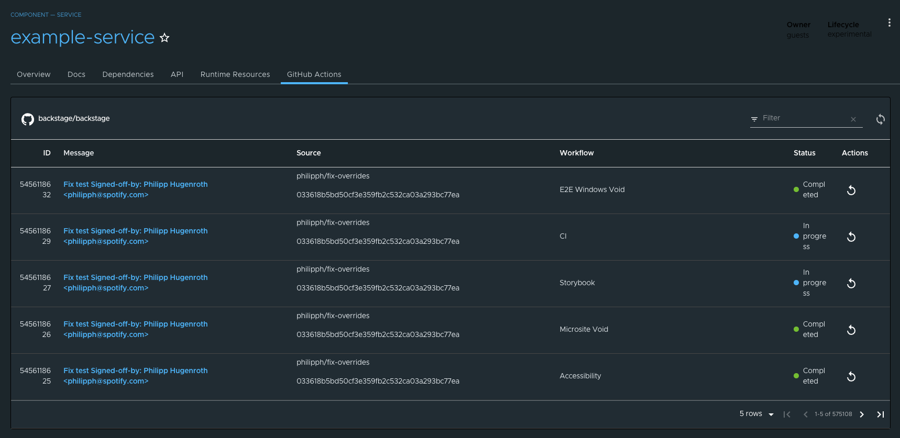

# Tanzu Portal Builder (TPB) - GitHub Actions Wrapper

## Introduction and OOTB features

This code is a wrapper for the [GitHub Actions plugin](https://github.com/backstage/backstage/tree/master/plugins/github-actions), it creates a view to visualize the workflows of a repository



## Plugin Wrapper Overview

This wrapper uses the concept of [Surfaces](../../README.md#frontend-plugins) to incorporate the GitHub Actions plugin into TPB.

What follows is a technical explanation of how this wrapping is done using the Surfaces APIs.

### Plugin Boilerplate

Let's create our plugin folder structure by making a copy of the [tpb-hello-world plugin](../tpb-hello-world/) and modifying its contents.
Don't forget to modify the `package.json` file to reflect the name and version of your wrapper. For this example, we've used `@tpb/plugin-github-actions` to keep the pattern used by other plugins.

### Defining an `AppPluginInterface`

In order for TPB to pick up the plugin, we need to create a definition of type `AppPluginInterface` which is defined by the `@tpb/core-frontend` package. This package should already be included in your dependencies if you created the boilerplate following the instructions above.

This definition is a high-order-function that returns a function that takes as parameter the `SurfaceStoreInterface`; this `SurfaceStoreInterface` will then be used to _apply_ the dependencies to the specified surfaces.

A barebones definition of a TPB wrapper plugin may look like the following:

```
export const PluginDefinition: AppPluginInterface = () => context: SurfaceStoreInterface => {
  context.apply(
    SurfaceToUse
    (surfaceToUse) => {
      surfaceToUse.add(element)
    },
  );
};

```

where `context` is of type `SurfaceStoreInterface`; `SurfaceToUse` is any subtype of `TpbSurface`, and the passed function is called a `SurfaceModifier`, which is where you can interact with the surfaces instances and add different stuff to them.
In the above example, we are calling the method `add` to pass an `element`, which is a `ReactElement`.

There are scenarios in which more surfaces need to be manipulated in order to integrate the plugin —such as this wrapper— and for those use cases the `SurfaceStoreInterface` exposes the method `applyWithDependency` in which it is possible to pass several `SurfaceConstructor` dependencies which will be then made available to the `SurfaceModifier` function as parameters.

## `AppPluginInterface` for GitHub Actions

Now let's take a look at how we can use all of the things that we've just described above to wrap the GitHub Actions plugin into TPB.

First, let's start by looking at our actual implementation of the `AppPluginInterface` definition.

```
import { EntityLayout } from '@backstage/plugin-catalog';
import { EntityGithubActionsContent } from '@backstage/plugin-github-actions';
import { AppPluginInterface, AppRouteSurface } from '@tpb/core-frontend';
import { EntityPageSurface } from '@tpb/plugin-catalog';
import React from 'react';

export const GithubActionsPlugin: AppPluginInterface = () => context => {
  context.applyWithDependency(
    AppRouteSurface,
    EntityPageSurface,
    (_, surface) => {
      surface.servicePage.addTab(
        <EntityLayout.Route path="/github-actions" title="GitHub Actions">
          <EntityGithubActionsContent />
        </EntityLayout.Route>,
      );
    },
  );
};
```

Let's analyze it:

`GithubActionsPlugin` is the main exportable part —the `AppPluginInterface` definition; it returns a function that receives a parameter we called `context` which is a `SurfaceStoreInterface`.

Then the function `applyWithDependency` is invoked from the `context` with two TPB Surfaces: `AppRouteSurface` and `EntityPageSurface`.

A comprehensive list of the available surfaces can be found [here](../../README.md) —However, do note that as the platform expands in features new surfaces will be made available and other plugins may also expose surfaces to use (such as in this case, where we obtain the `EntityPageSurface` from the `@tpb/plugin-catalog` package — don't forget to install it as a dependency: `yarn add @tpb/plugin-catalog`).

After figuring out our surfaces and installing the necessary dependencies for them, the last parameter that `applyWithDependency` receives is the `SurfaceModifier` function. This is where actual instances of the surfaces are provided to us in order to interact with them. In the example above we are obtaining the `servicePage` of the `EntityPageSurface` and calling `addTab` on it with a `ReactElement` being passed as parameter to the function.
This `ReactElement` consists of an `EntityLayout.Route` (obtained from `@backstage/plugin-catalog` so don't forget to install it as a dependency) and nested within it we find the component `EntityGithubActionsContent`. This component is provided by GitHub Actions plugin itself, so don't forget to install it: `yarn add '@backstage/plugin-github-actions'`.

The final part of creating our TPB plugin wrapper is exporting it. We do that in our [package's main](./src/index.ts):

```
export { GithubActionsPlugin as plugin } from './tpb-wrapper';

```

We _strongly_ suggest exporting your `AppPluginInterface` aliased as `plugin`, just like shown above, to keep your wrapper consistent with the pattern used in other existing TPB wrappers.

Now, to be able to visualize the workflows of a repository, we need to setup an entity with the annotation `github.com/project-slug`, for example:

```
apiVersion: backstage.io/v1alpha1
kind: Component
metadata:
  name: backstage
  description: backstage.io
  annotations:
    github.com/project-slug: 'backstage/backstage'
spec:
  type: website
  lifecycle: production
  owner: guests
```

## Build and publish the package

Now the only thing left to do with the wrapper is to package and publish it.

First, remember to verify the version defined in the [package.json](./package.json); then, from the folder of the plugin, run `yarn install` to install all dependencies, then run `yarn tsc` to verify that the typescript code compiles properly, and finally run `yarn build` to package it all.

Once all the above commands have been executed successfully, you should publish the package to any compatible registry by using `npm publish --registry="<<YOUR REGISTRY URL>"`.
Please refer to the [TPB Plugins documentation](../README.md) for considerations about the registries used to publish our packages.

## Integrate the package into your TPB instance

Refer to the [TPB Plugins main documentation](../README.md) for detailed instructions on how to integrate any published TPB wrapper into your running instance.
