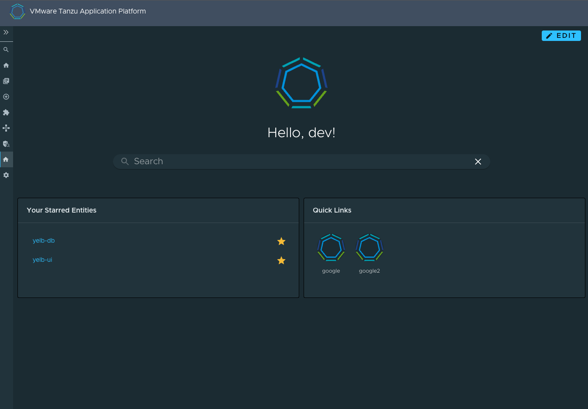

# Tanzu Portal Builder (TPB) - TechInsights Front-End Wrapper

## Introduction and OOTB features

This code is a thin wrapper for the [TechInsights Home plugin](https://github.com/backstage/backstage/tree/master/plugins/home) that, by default, includes the following widgets provided by the plugin:

- `CompanyLogo`
- `Your Starred Entities`
- `Toolkit`

It also uses the `HomePageSearchBar` widget provided by `@backstage/plugin-search`.
Additionaly, we're defining a very simple `HomePageWelcomeMessage` widget.

The end result looks like this:


## Plugin Wrapper Overview

This wrapper uses the concept of [Surfaces](../../README.md#frontend-plugins) to incorporate the Home plugin into TPB.

What follows is a technical explanation of how this wrapping is done using the Surfaces APIs.

### Plugin Boilerplate

Let's create our plugin folder structure by making a copy of the [tpb-hello-world plugin](../tpb-hello-world/) and modifying its contents.
Don't forget to modify the `package.json` file to reflect the name and version of your wrapper. For this example, we've used `@tpb/home-plugin` to keep the pattern used by other plugins.

### Defining an `AppPluginInterface`

In order for TPB to pick up the plugin, we need to create a definition of type `AppPluginInterface` which is defined by the `@tpb/core-frontend` package. This package should already be included in your dependencies if you created the boilerplate following the instructions above.

This definition is a high-order-function that returns a function that takes as parameter the `SurfaceStoreInterface`; this `SurfaceStoreInterface` will then be used to _apply_ the dependencies to the specified surfaces.

A barebones definition of a TPB wrapper plugin may look like the following:

```
export const PluginDefinition: AppPluginInterface = () => context: SurfaceStoreInterface => {
  context.apply(
    SurfaceToUse
    (surfaceToUse) => {
      surfaceToUse.add(element)
    },
  );
};

```

where `context` is of type `SurfaceStoreInterface`; `SurfaceToUse` is any subtype of `TpbSurface`, and the passed function is called a `SurfaceModifier`, which is where you can interact with the surfaces instances and add different stuff to them.
In the above example, we are calling the method `add` to pass an `element`, which is a `ReactElement`.

There are scenarios in which more surfaces need to be manipulated in order to integrate the plugin —such as this wrapper— and for those use cases the `SurfaceStoreInterface` exposes the method `applyWithDependency` in which it is possible to pass several `SurfaceConstructor` dependencies which will be then made available to the `SurfaceModifier` function as parameters.

## `AppPluginInterface` for Home plugin

Now let's take a look at how we can use all of the things that we've just described above to wrap the Home plugin into TPB.

First, let's start by looking at our implementation of the `AppPluginInterface` definition. Don't worry if there are things you don't understand at first — we'll be going over them in detail below.

```
import React from 'react';
import { HomepageCompositionRoot } from '@backstage/plugin-home';
import {
  AppPluginInterface,
  AppRouteSurface,
  SidebarItemSurface,
  SurfaceStoreInterface,
} from '@tpb/core-frontend';
import { Route } from 'react-router';
import customizableHomePage from '../home/CustomizableHomePage';
import { SidebarItem } from '@backstage/core-components';
import HomeIcon from '@material-ui/icons/Home';
import { HomeSurface } from '../HomeSurface';

export const HomePlugin: AppPluginInterface =
  () => (context: SurfaceStoreInterface) => {
    // Add route to app
    context.applyWithDependency(
      AppRouteSurface,
      HomeSurface,
      (appRouteSurface, homeSurface) => {
        appRouteSurface.add(
          <Route path="/home" element={<HomepageCompositionRoot />}>
            // Nested home page component with surface wiring
            <HomePage surface={homeSurface} />
          </Route>,
        );
      },
    );

    // Add sidebar entry
    context.applyTo(SidebarItemSurface, (sidebar: SidebarItemSurface) => {
      sidebar.addMainItem(
        <SidebarItem icon={HomeIcon} to="home" text="Home page" />,
      );
    });
  };
```

Let's analyze it:

`HomePlugin` is the main exportable part —the `AppPluginInterface` definition; it returns a function that receives a parameter we called `context` which is a `SurfaceStoreInterface`.

We will be using this `context` to obtain different surfaces and interacting with them.
In order to do this we invoke the function `applyWithDependency` from the `context` with two TPB Surfaces: `AppRouteSurface` (coming from `@tpb/core-frontend`) and `HomeSurface` (provided by us — more on this later on).

At this point you may be wondering: How do we know which surfaces are needed?
The answer is that it depends on the parts of the application that you want to modify. We see in the [Home plugin documentation](https://github.com/backstage/backstage/tree/master/plugins/home) that adding the home page requires adding a `Route` component that takes in `HomepageCompositionRoot` as `element` and allows nesting our custom home page within it. Since we need to add a route to the app, the `AppRouteSurface` is required. `HomeSurface` is also required; this is a necessary step to provide our own surface and wire it correctly.

We also want the home page to appear in the sidebar, so in a different invocation to `context.applyTo` we require the `SidebarItemSurface` (provided by `@tpb/core-frontend`) so that we can add a `SidebarItem` (also provided by `@tpb/core-frontend`) to it.

A comprehensive list of the available surfaces can be found [here](../../README.md) —However, do note that as the platform expands in features new surfaces will be made available and plugins may also expose surfaces of their own, such as in this case, where we will be defining a `HomeSurface` and exposing it for others plugins to use.

For now just notice that we used the method `applyWithDependency` because we will be using two surfaces at once: `HomeSurface` and `AppRouteSurface`.

After figuring out our surfaces, the last parameter that `applyWithDependency` (or `applyTo`) receives is the `SurfaceModifier` function. This is where actual instances of the surfaces are provided to us in order to interact with them. In the example above we are obtaining the `appRouteSurface` instance and calling `add` on it with a `ReactElement` being passed as parameter to the function.
This `ReactElement` consists of a `Route` element (obtained from `react-router` so don't forget to install it as a dependency) and nested within it we find the home plugin component: the `HomepageCompositionRoot`. This component is provided by Home plugin itself, so don't forget to install it: `yarn add '@backstage/plugin-home`.
Nested within this `HomepageCompositionRoot` we will be adding our custom page and using the `homeSurface` instance of our exposed `HomeSurface`, so let's take a look at how we can define that.

### Defining the `HomeSurface`:

A front-end surface is a class that represents different sections of a part of the application, and for each of those sections an array is exposed to the user so that `ReactElement`s may be pushed to it.

For our `HomeSurface` we will be exposing three different sections:

- `widgets` for the widget-like components that are created using `createComponentExtension`,
- `content` for non-widget components,
- `widgetConfigs` for the [LayoutConfiguration]() of each widget to be added.

Putting together a basic surface class with these sections we end up with this:

```
import { LayoutConfiguration } from '@backstage/plugin-home';
import { ReactElement } from 'react';

export class HomeSurface {
  public static readonly id = 'HomeSurface';
  private readonly _homeWidgets: ReactElement[];
  private readonly _homeContent: ReactElement[];
  private readonly _widgetConfigs: LayoutConfiguration[];

  constructor() {
    this._homeWidgets = [];
    this._homeContent = [];
    this._widgetConfigs = [];
  }

  public addWidget(item: ReactElement, config?: LayoutConfiguration) {
    this._homeWidgets.push(item);

    if (config) {
      this._widgetConfigs.push(config);
    }
  }

  public addContent(item: ReactElement) {
    this._homeContent.push(item);
  }

  public addWidgetConfig(config: LayoutConfiguration) {
    this._widgetConfigs.push(config);
  }

  public get widgets(): ReactElement[] {
    return this._homeWidgets;
  }

  public get content(): ReactElement[] {
    return this._homeContent;
  }

  public get widgetConfigs(): LayoutConfiguration[] {
    return this._widgetConfigs;
  }
}
```

Notice the `public static readonly id` attribute — this is required in order for the `SurfaceStore` to be able to locate our surface when needed (such as when calling `applyTo` or `applyWithDependency`).
The rest of the class is pretty straight-forward: some `get` accesors for our private sections, and methods to add elements to each of them.

Now that we have our surface defined let's go back to the `AppPluginInterface` and understand the wiring that's required to make the surface work.

### Wiring the `HomeSurface`

Let's take a look at the snippet of our plugin definition where we're using the `AppRouteSurface` and the `HomeSurface`:

```
context.applyWithDependency(
  AppRouteSurface,
  HomeSurface,
  (appRouteSurface, homeSurface) => {
    appRouteSurface.add(
      <Route path="/home" element={<HomepageCompositionRoot />}>
        // Nested home page component with surface wiring
        <HomePage surface={homeSurface} />
      </Route>,
    );
  },
);
```

As previously mentioned, we call `applyWithDependency` and provide the classes for the two surfaces we will be using: `AppRouteSurce` and `HomeSurface` (which is simply imported locally from this same proyect: `import { HomeSurface } from '../HomeSurface';`). This call will find the instances of these surfaces in the `SurfaceStore` and make them available to us in the `SurfaceModifierFunction`; it is in this function, nested within the `Route` component, where we will pass the `homeSurface` instance to a react component of our own called `HomePage` —we'll look at the definition of this component next.

For now simply notice that this is all the wiring necessary for defining a custom surface: require the class when calling `applyWithDependency` and pass the obtained instance to your custom component, where you will, in turn, render whatever was added to the different sections of the surface.

### The `HomePage` component

`HomePage` is a simply a react component that takes in the `surface` as a prop and renders the elements added to it. We will also be adding several widgets to this component.

It is thus defined as follows:

```
import React from 'react';
import {
  HomePageStarredEntities,
  CustomHomepageGrid,
  HomePageCompanyLogo,
  HomePageToolkit,
  Tool,
} from '@backstage/plugin-home';
import { HomePageSearchBar } from '@backstage/plugin-search';
import { makeStyles, Theme } from '@material-ui/core/styles';
import { configApiRef, useApi } from '@backstage/core-plugin-api';
import QuickLinkIcon from '../components/QuickLinkIcon';
import { HomePageWelcomeMessage } from '../components/HomePageWelcomeMessage';
import { HomeSurface } from '../HomeSurface';

export type HomePageProps = {
  surface: HomeSurface;
};

type QuickLink = {
  url: string;
  label: string;
  icon?: string;
};

const useStyles = makeStyles((theme: Theme) => ({
  content: {
    '& > :first-child': {
      height: 'auto',
      marginTop: '10px',
      marginLeft: '-20px',
      marginRight: '-20px',
      marginBottom: '10px',
    },
  },
  logo: {
    marginLeft: 'auto',
    marginRight: 'auto',
  },
  container: {
    margin: theme.spacing(2, 0),
    display: 'flex',
    justifyContent: 'center',
  },
  searchBarContainer: {
    backgroundColor: theme.palette.background.paper,
    borderRadius: '50px !important',
    boxShadow: theme.shadows[1],
    padding: theme.spacing(0, 2),
    borderStyle: 'none !important',
  },
}));

function HomePage(props: HomePageProps) {
  const { surface } = props;
  const classes = useStyles();
  const config = useApi(configApiRef);
  const logo = config.getOptionalString('customize.features.home.logo');
  const logoSrc = `data:image/svg+xml;base64,${logo}`;

  const quickLinks =
    config.getOptional<QuickLink[]>('customize.features.home.quickLinks') || [];
  const parsedLinks: Tool[] = quickLinks.map(({ url, label, icon }) => {
    return {
      url,
      label,
      icon: icon && <QuickLinkIcon icon={icon} label={label} />,
    };
  });

  const widgetConfigs = surface.widgetConfigs;
  const defaultConfig = [
    {
      component: 'CompanyLogo',
      x: 0,
      y: 0,
      width: 12,
      height: 8,
    },
    {
      component: 'HomePageWelcomeMessage',
      x: 0,
      y: 13,
      width: 12,
      height: 4,
    },
    {
      component: 'HomePageSearchBar',
      x: 2,
      y: 16,
      width: 8,
      height: 5,
    },
    {
      component: 'HomePageStarredEntities',
      x: 0,
      y: 18,
      width: 6,
      height: 12,
    },
    {
      component: 'HomePageToolkit',
      x: 7,
      y: 18,
      width: 6,
      height: 12,
    },
    ...widgetConfigs,
  ];

  // Fix for `CustomHomePageGrid` bug — lacks `xl` value definition and crashes on big screens
  const breakpoints = { xl: 12, lg: 12, md: 10, sm: 6, xs: 4, xxs: 2 };

  return (
    <div className={classes.content}>
      <CustomHomepageGrid
        config={defaultConfig}
        rowHeight={10}
        breakpoints={breakpoints}
      >
        <HomePageCompanyLogo
          className={classes.container}
          logo={
            
          }
        />
        <HomePageWelcomeMessage />
        <HomePageSearchBar
          className={classes.searchBarContainer}
          placeholder="Search"
        />
        <HomePageStarredEntities />
        <HomePageToolkit title="Quick Links" tools={parsedLinks} />
        {surface.widgets}
      </CustomHomepageGrid>
      {surface.content}
    </div>
  );
}

export default HomePage;
```

This is a fairly common react function component: It takes in some props (our `homeSurface` instance), obtains some data read from the config file, does some styling, and then renders some JSX.

There are two things of special note here:
The first one is the usage of the `CustomHomepageGrid` component provided by `@backstage/plugin-home`; this component must be used if we want our homepage to provide widgets and the add/remove functionality associated with them. It may take a parameter called `config` which defines which are the default widgets that should appear on the page. For more information about this config and some other options please refer to the [Home plugin documentation](https://github.com/backstage/backstage/tree/master/plugins/home#adding-default-layout).

The second one is the `defaultConfig` definition that will be passed to the `config` prop of the `CustomHomePageGrid`. Note that we are extending this config definition with all the configs passed to the `HomeSurface`'s `widgetConfigs`:

```
const widgetConfigs = surface.widgetConfigs;
  const defaultConfig = [
    {
      component: 'CompanyLogo',
      x: 0,
      y: 0,
      width: 12,
      height: 8,
    },
    {
      component: 'HomePageWelcomeMessage',
      x: 0,
      y: 13,
      width: 12,
      height: 4,
    },
    {
      component: 'HomePageSearchBar',
      x: 2,
      y: 16,
      width: 8,
      height: 5,
    },
    {
      component: 'HomePageStarredEntities',
      x: 0,
      y: 18,
      width: 6,
      height: 12,
    },
    {
      component: 'HomePageToolkit',
      x: 7,
      y: 18,
      width: 6,
      height: 12,
    },
    ...widgetConfigs,
  ];
```

(The `breakpoints` parameter defines the number of columns that the grid will have at different breakpoints. This is needed due to what is most likely a bug with the grid's default breakpoint values that lack an `xl` definition and thus may cause it to throw errors if used in really big viewports (`xl`).)

Inside the `CustomHomePageGrid` we add the widget components we obtain from the home plugin, the search plugin, and, crucially, the widgets added to the `HomeSurface`:

```
<CustomHomepageGrid ...>
  <HomePageCompanyLogo.../>
  <HomePageWelcomeMessage />
  <HomePageSearchBar />
  <HomePageStarredEntities />
  <HomePageToolkit .../>
  {surface.widgets}
</CustomHomepageGrid>
```

- `HomePageCompanyLogo`, `HomePageStarredEntities`, and `HomePageToolkit` are imported from `@backstage/plugin-home`
- `HomePageSearchBar` is provided by `@backstage/plugin-search`
- `HomePageWelcomeMessage` is a widget component of our own — we'll revise it later in the guide.

Note that `surface.widgets` is used _within_ `CustomHomePageGrid` whereas `surface.content` is used _outside_ of it —this is due to the behavior of `CustomHomePageGrid` that only displays widgets defined using `createCardExtension` or `createComponentExtension`. The widgets provided by other plugins already fulfill this definition and thus can be used within it.

### Creating the `HomePageWelcomeMessage` widget

In order to create a widget we need to first define a normal react component and then wrap it in a call to `createComponentExtension` and provide it to the plugin. Let's take a look.

First, the react component:

```
import React from 'react';
import { configApiRef, useApi } from '@backstage/core-plugin-api';
import { makeStyles, Theme } from '@material-ui/core/styles';
import { Typography } from '@material-ui/core';

const useStyles = makeStyles((theme: Theme) => ({
  container: {
    margin: theme.spacing(1, 0),
    display: 'flex',
    justifyContent: 'center',
  },
}));

export function WelcomeMessage() {
  const classes = useStyles();
  const config = useApi(configApiRef);
  const welcomeMessage = config.getOptionalString(
    'customize.features.home.welcomeMessage',
  );

  return (
    <div className={classes.container}>
      <Typography variant="h1">{welcomeMessage}</Typography>
    </div>
  );
}
```

This is a fairly simple component that reads a message from the config file and then displays it within a div — nothing fancy.

Now, the widget definition:

```
import { createComponentExtension } from '@backstage/core-plugin-api';
import { homePlugin } from '@backstage/plugin-home';

export const HomePageWelcomeMessage = homePlugin.provide(
  createComponentExtension({
    name: 'HomePageWelcomeMessage',
    component: {
      lazy: () => import('./WelcomeMessage').then(m => m.WelcomeMessage),
    },
  }),
);
```

In here we are using the `provide` function from the `homePlugin` and passing to it the definition of a component that is created by calling `createComponentExtension` — this function receives two parameters: the `name` of the widget and the `component` to load.

And that's it. `HomePageWelcomeMessage` is now a widget wrapper of the `WelcomeMessage` component and can thus be used within `CustomHomePageGrid`.
For more information about creating home widgets please refer to the [Home plugin documentation](https://github.com/backstage/backstage/tree/master/plugins/home#creating-customizable-components)

The final part of creating our TPB plugin wrapper is exporting it. We do that in our [package's main](./src/index.ts):

```
export { HomePlugin as plugin } from './tpb-wrapper';
export * from './HomeSurface';
```

We _strongly_ suggest exporting your `AppPluginInterface` aliased as `plugin`, just like shown above, to keep your wrapper consistent with the pattern used in other existing TPB wrappers.

Finally, don't forget to export the surface as well.

### Providing config values

This plugin wrapper uses several values read from the config file' they must be specified in order to get the full functionaly described above.

In order to expose this we need to define in the plugin folder a file that must be called `config.d.ts`. In it we should define the types of config values that the plugin will be reading and the visibility of these flags.

It looks like this:

```
export interface Config {
  customize?: {
    features?: {
      home?: {
        /**
         * base64 encoded SVG image.
         * @visibility frontend
         */
        logo?: string;
        /**
         * @visibility frontend
         */
        welcomeMessage?: string;
        /**
         * @visibility frontend
         */
        quickLinks?: {
          /**
           * @visibility frontend
           */
          url: string;
          /**
           * @visibility frontend
           */
          label: string;
          /**
           * base64 encoded SVG image.
           * @visibility frontend
           */
          icon?: string;
        }[];
      };
    };
  };
}
```

Then we need to go to our plugin [`package.json`](./package.json) and add the following two sections:

```
...
"configSchema": "config.d.ts"
...
"files": [
    "config.d.ts",
    "dist"
  ],
...
```

And with that our plugin may now read these config values. Then they must be specified in the `app-config.yaml` file used to build TPB. The result may look like this:

```
customize:
  features:
    home:
      logo: # base64-encoded SVG image
      welcomeMessage: Hello, dev!
      quickLinks:
        - url: https://google.com
          label: google
          icon: # base64-encoded SVG image
        - url: https://google.com
          label: google2
          icon: # base64-encoded SVG image
```

## Build and publish the package

Now the only thing left to do with the wrapper is to package and publish it.

First, remember to verify the version defined in the [package.json](./package.json); then, from the folder of the plugin, run `yarn install` to install all dependencies, then run `yarn tsc` to verify that the typescript code compiles properly, and finally run `yarn build` to package it all.

Once all the above commands have been executed successfully, you should publish the package to any compatible registry by using `npm publish --registry="<<YOUR REGISTRY URL>"`.
Please refer to the [TPB Plugins documentation](../README.md) for considerations about the registries used to publish our packages.

And that's it. You now have a published TPB wrapper for TechInsight's Front-End plugin.

## Integrate the package into your TPB instance

Refer to the [TPB Plugins main documentation](../README.md) for detailed instructions on how to integrate any published TPB wrapper into your running instance.
