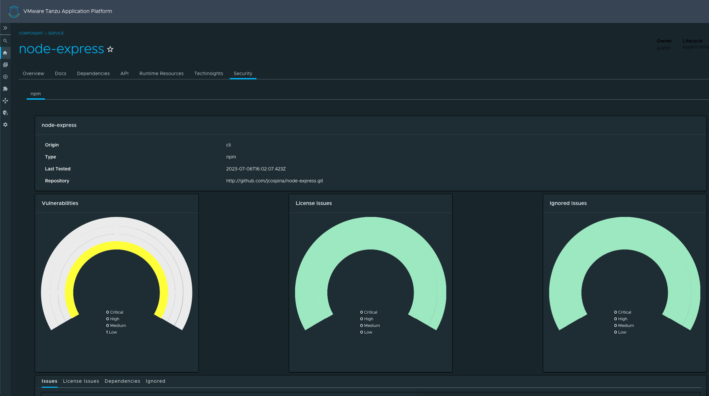
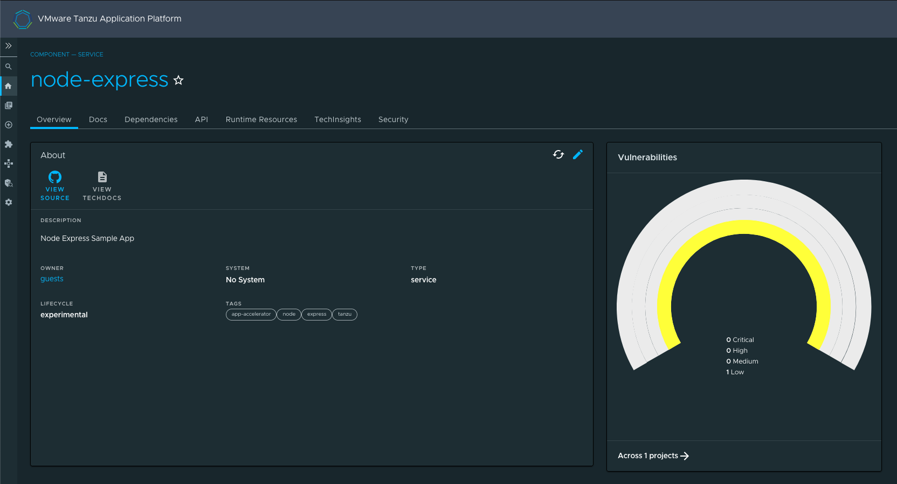

# Tanzu Portal Builder (TPB) - Snyk Plugin Front-End Wrapper

## Introduction

This code is a thin wrapper for the [Snyk Plugin](https://github.com/snyk-tech-services/backstage-plugin-snyk) which includes two main components:

- SnykOverview: shows an overview of the vulnerabilities found by Snyk on the Overview tab of an entity
- EntitySnykContent: adds a tab to the entity view showing all details related to the scan.

Snyk Overview


Snyk Tab


## Plugin Wrapper Overview

This wrapper uses the concept of [Surfaces](../../README.md#frontend-plugins) to incorporate the Snyk plugin into TPB.

What follows is a technical explanation of how this wrapping is done using the Surfaces APIs.

### Plugin Boilerplate

Let's create our plugin folder structure by making a copy of the [tpb-hello-world plugin](../tpb-hello-world/) and modifying its contents.
Don't forget to modify the `package.json` file to reflect the name and version of your wrapper. For this example, we've used `@tpb/plugin-snyk` to keep the pattern used by other plugins.

### Defining an `AppPluginInterface`

In order for TPB to pick up the plugin, we need to create a definition of type `AppPluginInterface` which is defined by the `@tpb/core-frontend` package. This package should already be included in your dependencies if you created the boilerplate following the instructions above.

This definition is a high-order-function that returns a function that takes as parameter the `SurfaceStoreInterface`; this `SurfaceStoreInterface` will then be used to _apply_ the dependencies to the specified surfaces.

A barebones definition of a TPB wrapper plugin may look like the following:

```
export const PluginDefinition: AppPluginInterface = () => context: SurfaceStoreInterface => {
  context.apply(
    SurfaceToUse
    (surfaceToUse) => {
      surfaceToUse.add(element)
    },
  );
};

```

where `context` is of type `SurfaceStoreInterface`; `SurfaceToUse` is any subtype of `TpbSurface`, and the passed function is called a `SurfaceModifier`, which is where you can interact with the surfaces instances and add different stuff to them.
In the above example, we are calling the method `add` to pass an `element`, which is a `ReactElement`.

There are scenarios in which more surfaces need to be manipulated in order to integrate the plugin —such as this wrapper— and for those use cases the `SurfaceStoreInterface` exposes the method `applyWithDependency` in which it is possible to pass several `SurfaceConstructor` dependencies which will be then made available to the `SurfaceModifier` function as parameters.

## `AppPluginInterface` for Snyk

Now let's take a look at how we can use all of the things that we've just described above to wrap the Snyk plugin into TPB.

First, let's start by looking at our actual implementation of the `AppPluginInterface` definition.

```
import React from 'react';
import {AppPluginInterface, AppRouteSurface, SurfaceStoreInterface} from "@tpb/core-frontend";
import {EntityPageSurface} from "@tpb/plugin-catalog";
import {EntitySnykContent, isSnykAvailable, SnykOverview} from "backstage-plugin-snyk";
import {EntityLayout, EntitySwitch} from "@backstage/plugin-catalog";
import {Grid} from "@material-ui/core";

export const SnykPlugin: AppPluginInterface
    = () => (context: SurfaceStoreInterface) => {
    context.applyWithDependency(
        AppRouteSurface,
        EntityPageSurface,
        (_appRouteSurface, entityPageSurface) => {
            entityPageSurface.addOverviewContent(
                <EntitySwitch>
                    <EntitySwitch.Case if={isSnykAvailable}>
                        <Grid item md={3}>
                            <SnykOverview/>
                        </Grid>
                    </EntitySwitch.Case>
                </EntitySwitch>
            )
            entityPageSurface.servicePage.addTab(
                <EntityLayout.Route path="/snyk" title="Security">
                    <EntitySnykContent/>
                </EntityLayout.Route>
            )
        }
    )
}

```

Let's analyze it:

`SnykPlugin` is the main exportable part -the `AppPluginInterface` definition; it returns a function that receives a
parameter we called `context` which is a `SurfaceStoreInterface`.

Then the function `applyWithDependency` is invoked from the `context` with two TPB Surfaces: `AppRouteSurface` and
`EntityPageSurface`.

At this point you may be wondering: How do we know which surfaces are needed? The answer is that it depends on the
parts of the application that you want to modify. For Snyk we have two main components that make up the plugin
functionality: a `SnykOverview` component which is meant to appear on the overview tab of an entity, and a
`EntitySnykContent` component which adds a tab to the EntityPage. To achieve this we require the `EntityPageSurface`
which is the Surface that allows adding functionality to entities; we also require the AppRouteSurface because we
are adding a new route to the application.

A comprehensive list of the available surfaces can be found [here](../../README.md) —However, do note that as the
platform expands in features new surfaces will be made available and other plugins may also expose surfaces to use
(such as in this case, where we obtain the `EntityPageSurface` from the `@tpb/plugin-catalog` package — don't forget
to install it as a dependency: `yarn add @tpb/plugin-catalog`).

After figuring out our surfaces and installing the necessary dependencies for them, the last parameter that `applyWithDependency`
receives is the `SurfaceModifier` function. This is where actual instances of the surfaces are provided to us in
order to interact with them. In the example above we are using two of the available options of the `EntityPageSurface`.
First we are calling the `addOverviewContent` and passing a `ReactElement` to it. This element represents a card to
display on the overview tab of an entity and in this particular case is the `SnykOverview` wrapped in an `EntitySwitch`.
Finally, we are obtaining the `servicePage` (there are other type of pages available such as `apiPage`, `groupPage`, `websitePage`,
etc.) and calling `addTab` on it with a `ReactElement` being passed as a parameter. This `ReactElement` consists of an
`EntityLayout.Route` (obtained from `@backstage/plugin-catalog` so don't forget to install it as a dependency) and nested
within it, we find the snyk component: `EntitySnykContent`. This component is provided by the Snyk plugin itself, so
don't forget to install it: `yarn add 'backstage-plugin-snyk'`.

The final part of creating our TPB plugin wrapper is exporting it. We do that in our [package's main](./src/index.ts):

```
export {SnykPlugin as plugin} from './tpb-wrapper';
```

We _strongly_ suggest exporting your `AppPluginInterface` aliased as `plugin`, just like shown above, to keep your wrapper
consistent with the pattern used in other existing TPB wrappers.

## Build and publish the package

Now the only thing left to do with the wrapper is to package and publish it.

First, remember to verify the version defined in the [package.json](./package.json); then, from the folder of the plugin,
run `yarn install` to install all dependencies, then run `yarn tsc` to verify that the typescript code compiles properly,
and finally run `yarn build` to package it all.

Once all the above commands have been executed successfully, you should publish the package to any compatible registry by
using `npm publish --registry="<<YOUR REGISTRY URL>"`. Please refer to the [TPB Plugins documentation](../README.md) for
considerations about the registries used to publish our packages.

And that's it. You now have a published TPB wrapper for the Snyk plugin.

## Integrate the package into your TPB instance

Refer to the [TPB Plugins main documentation](../README.md) for detailed instructions on how to integrate any published
TPB wrapper into your running instance.
