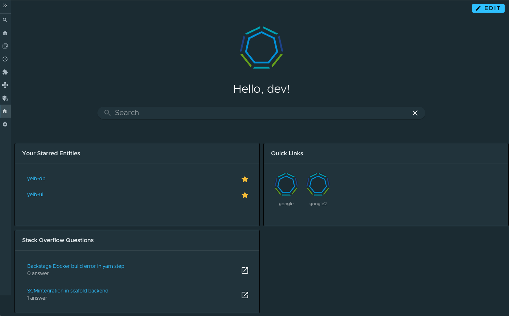

# Tanzu Portal Builder (TPB) - Stack Overflow Front-End Wrapper

## Introduction and OOTB features

This code is a thin wrapper for the [Backstage Stack Overflow plugin](https://github.com/backstage/backstage/tree/master/plugins/stack-overflow) that provides a `HomePageStackOverflowQuestions` that will be used in the Home page to display a card with Stack Overflow questions.

Note that this plugin requires the [TPB Home Plugin](../tpb-home/) to be installed and configured, as it relies on the `HomeSurface` exposed by it.

The end result looks like this:


## Plugin Wrapper Overview

This wrapper uses the concept of [Surfaces](../../README.md#frontend-plugins) to incorporate the Home plugin into TPB.

What follows is a technical explanation of how this wrapping is done using the Surfaces APIs.

### Plugin Boilerplate

Let's create our plugin folder structure by making a copy of the [tpb-hello-world plugin](../tpb-hello-world/) and modifying its contents.
Don't forget to modify the `package.json` file to reflect the name and version of your wrapper. For this example, we've used `@tpb/plugin-stack-overflow` to keep the pattern used by other plugins.

### Defining an `AppPluginInterface`

In order for TPB to pick up the plugin, we need to create a definition of type `AppPluginInterface` which is defined by the `@tpb/core-frontend` package. This package should already be included in your dependencies if you created the boilerplate following the instructions above.

This definition is a high-order-function that returns a function that takes as parameter the `SurfaceStoreInterface`; this `SurfaceStoreInterface` will then be used to _apply_ the dependencies to the specified surfaces.

A barebones definition of a TPB wrapper plugin may look like the following:

```
export const PluginDefinition: AppPluginInterface = () => context: SurfaceStoreInterface => {
  context.apply(
    SurfaceToUse
    (surfaceToUse) => {
      surfaceToUse.add(element)
    },
  );
};
```

where `context` is of type `SurfaceStoreInterface`; `SurfaceToUse` is any subtype of `TpbSurface`, and the passed function is called a `SurfaceModifier`, which is where you can interact with the surfaces instances and add different stuff to them.
In the above example, we are calling the method `add` to pass an `element`, which is a `ReactElement`.

There are scenarios in which more surfaces need to be manipulated in order to integrate the plugin —such as this wrapper— and for those use cases the `SurfaceStoreInterface` exposes the method `applyWithDependency` in which it is possible to pass several `SurfaceConstructor` dependencies which will be then made available to the `SurfaceModifier` function as parameters.

## `AppPluginInterface` for Stack Overflow plugin

Now let's take a look at how we can use all of the things that we've just described above to wrap the Home plugin into TPB.

First, let's start by looking at our implementation of the `AppPluginInterface` definition.

```
import {
  AppPluginInterface,
  AppPluginSurface,
  SurfaceStoreInterface,
} from '@tpb/core-frontend';
import { HomeSurface } from '@tpb/plugin-home';
import React from 'react';
import {
  HomePageStackOverflowQuestions,
  stackOverflowPlugin,
} from '@backstage/plugin-stack-overflow';

export const StackOverflowPlugin: AppPluginInterface =
  () => (context: SurfaceStoreInterface) => {
    context.applyTo(AppPluginSurface, appPluginSurface => {
      appPluginSurface.add(stackOverflowPlugin);
    });

    context.applyTo(HomeSurface, homeSurface => {
      homeSurface.addWidget(
        <HomePageStackOverflowQuestions
          requestParams={{
            tagged: 'backstage',
            site: 'stackoverflow',
            pagesize: 5,
          }}
        />,
        {
          component: 'HomePageStackOverflowQuestions',
          width: 6,
          height: 12,
          x: 0,
          y: 30,
        },
      );
    });
  };

```

Let's analyze it:

`StackOverflowPlugin` is the main exportable part —the `AppPluginInterface` definition; it returns a function that receives a parameter we called `context` which is a `SurfaceStoreInterface`.

We will be using this `context` to obtain different surfaces and interacting with them.
In order to do this we're going to invoke the function `applyTo` from the `context` and pass a surface to it.
You'll notice that we are making this `applyTo` call two times: the first time passing the `AppPluginSurface` because we would like to register the [Stack Overflow plugin](https://github.com/backstage/backstage/blob/master/plugins/stack-overflow/src/index.ts#L23C7-L23C7) into it. For the second call we pass the `HomeSurface`, which allows us to add widgets to the Home page that the [TPB Home plugin](../tpb-home/) creates.

At this point you may be wondering: How do we know which surfaces are needed?
The answer is that it depends on the parts of the application that you want to modify and what the plugin to integrate exports. Though the [Stack Overflow plugin documentation](https://github.com/backstage/backstage/blob/master/plugins/stack-overflow/README.md) doesn't specify it, looking at the source code we see that it exposes a `BackstagePlugin`, and looking at the TPB Surfaces we found that there is an `AppPluginSurface` upon which backstage plugins can be registered. The other thing that we would like to do is modify the Home page, and to that end the `TPB Home plugin` exposes a `HomeSurface`. This is a good moment to install both of those packages as dependencies:

```
yarn install @backstage/plugin-stack-overflow
yarn install @tpb/plugin-home
```

A comprehensive list of the available surfaces can be found [here](../../README.md) —However, do note that as the platform expands in features new surfaces will be made available and plugins may also expose surfaces of their own.

After figuring out our surfaces, the last parameter that `applyTo` receives is the `SurfaceModifier` function. This is where an actual instance of the surface is provided to us in order to interact with it.
In the example above in the first call we are obtaining the `appPluginSurface` instance and calling `add` on it with the `stackOverflowPlugin` exported by `@backstage/plugin-stack-overflow`. Doing this will ensure that all the `apiRefs` (and their implementations) exposed by the Stack Overflow plugin are properly registered in the app.
For the second call we obtain the `homeSurface` instance and use the method `addWidget` to install the `HomePageStackOverflowQuestions` widget in the Home page. This `addWidget` method receives a second optional parameter called `config`, which is the (`LayoutConfiguration`)[https://github.com/backstage/backstage/tree/master/plugins/home#adding-default-layout] for the widget we're adding.

The final part of creating our TPB plugin wrapper is exporting it. We do that in our [package's main](./src/index.ts):

```
export { StackOverflowPlugin as plugin } from './tpb-wrapper';
```

We _strongly_ suggest exporting your `AppPluginInterface` aliased as `plugin`, just like shown above, to keep your wrapper consistent with the pattern used in other existing TPB wrappers.

## Build and publish the package

Now the only thing left to do with the wrapper is to package and publish it.

First, remember to verify the version defined in the [package.json](./package.json); then, from the folder of the plugin, run `yarn install` to install all dependencies, then run `yarn tsc` to verify that the typescript code compiles properly, and finally run `yarn build` to package it all.

Once all the above commands have been executed successfully, you should publish the package to any compatible registry by using `npm publish --registry="<<YOUR REGISTRY URL>"`.
Please refer to the [TPB Plugins documentation](../README.md) for considerations about the registries used to publish our packages.

And that's it. You now have a published TPB wrapper for TechInsight's Front-End plugin.

## Integrate the package into your TPB instance

Refer to the [TPB Plugins main documentation](../README.md) for detailed instructions on how to integrate any published TPB wrapper into your running instance.
