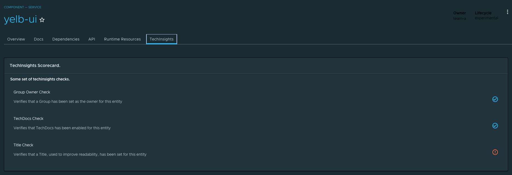

# TPB - TechInsights

## Introduction and OOTB features

This plugin provides the UI for the `@tpb/plugin-techinsights-backend` plugin wrapper which allows display of the results of the checks that stem from the rules and the logic defined in the backend.

This code wraps the TechInsights plugin that, by default, includes a scorecard that showcases the results of the following 3 fact checkers [already provided](https://github.com/backstage/backstage/tree/master/plugins/tech-insights-backend#included-factretrievers) by TechInsights:

- entityOwnershipFactRetriever
- entityMetadataFactRetriever
- techdocsFactRetriever

Used in conjunction with the [Backend wrapper](../tpb-techinsights-backend/) it brings TechInsight's default functionalities into TPB. The end result looks similar to this:



## Plugin Wrapper Overview

This wrapper uses the concept of [Surfaces](https://gitlab.eng.vmware.com/esback/core#frontend-plugins) to incorporate the TechInsights plugin into TPB.

What follows is a technical explanation of how this wrapping is done using the Surfaces APIs.

### Creating a plugin boilerplate

...

### Defining an AppPluginInterface

In order for TPB to pick up the plugin we need to create a definition of type `AppPluginInterface` which is defined by the `@tpb/core-frontend` package.
This definition is a high-order-function that returns a function that takes in as parameter the `SurfaceStoreInterface`; this `SurfaceStoreInterface` will be then used to _apply_ the dependencies to the specified surfaces.

A barebones definition of a plugin may look like the following:

```
export const PluginDefinition: AppPluginInterface = () => context: SurfaceStoreInterface => {
  context.apply(
    SurfaceToUseConstructor
    (surfaceToUse) => {
      surfaceToUse.add(element)
    },
  );
};

```

where `context` is of type `SurfaceStoreInterface`, `SurfaceToUseConstructor` is any subtype of `SurfaceConstructor` and the passed function is called a `SurfaceModifier` which is where you can interact with the surfaces instances and add different stuff to them.
In the above example we are using the method `add` to pass an `element` which is a `ReactElement`.

There are scenarios in which more surfaces need to be manipulated in order to integrate the plugin —such as this wrapper— and for those use cases the `SurfaceStoreInterface` exposes the method `applyWithDependency` in which it is possible to pass several `SurfaceConstructor` dependencies which will be then made available to the `SurfaceModifier` function as parameters.

Now let's take a look at how we can use all of the things that we've just described above to wrap the techinsights plugin into TPB.

First, here is the `AppPluginInterface` definition.

```
import { EntityLayout } from '@backstage/plugin-catalog';
import { EntityTechInsightsScorecardContent } from '@backstage/plugin-tech-insights';
import { AppPluginInterface, AppRouteSurface } from '@tpb/core-frontend';
import { EntityPageSurface } from '@tpb/plugin-catalog';
import React from 'react';

export const TechInsightsFrontendPlugin: AppPluginInterface = () => context => {
  context.applyWithDependency(
    AppRouteSurface,
    EntityPageSurface,
    (_, surface) => {
      surface.servicePage.addTab(
        <EntityLayout.Route path="/techinsights" title="TechInsights">
          <EntityTechInsightsScorecardContent
            title="TechInsights Scorecard."
            description="Some set of techinsights checks."
          />
        </EntityLayout.Route>,
      );
    },
  );
};

```

Now let's analyze it step by step.

`TechInsightsFrontenPlugin` is the main exportable part, the `AppPluginInterface` definition; it returns a function that receives a parameter we called `context` which is the `SurfaceStoreInterface`.

Then the function `applyWithDependency` is invoqued from the `context` with two surface constructors: `AppRouteSurface` and `EntityPageSurface`.

At this point you may be wondering: how do we know which surfaces are needed?
The answer is that it depends on the parts of the application that you want to modify. For this particular scenario we see in the [TechInsights FrontEnd Documentation](https://github.com/backstage/backstage/blob/master/plugins/tech-insights/README.md#add-boolean-checks-overview-scorecards-page-to-the-entitypage) that adding a `EntityTechInsightsScorecardContent` requires modifying the `EntityPage`, specifically adding a nested route to it. So we require the `EntityPageSurface` so that we can add stuff to it, and we also require the `AppRouteSurface` because we are adding a new route to the application.

A comprehensive list of the available surfaces can be found [here](https://gitlab.eng.vmware.com/esback/core/-/blob/main/README.md) — However, do note that as the platform expands in features new surfaces will be made available and other plugins may also expose surfaces to use (such as in this case, where we obtain the `EntityPageSurface` from the `@tpb/plugin-catalog` package).

After figuring out our surfaces, the last paramater that `applyWithDependency` receives is the `SurfaceModifier` function. This is where actual instances of the surfaces are provided to us in order to interact with them. In the example above we are obtaining the `servicePage` of the `EntityPageSurface` and calling `addTab` on it, meaning that we want our scorecard to show up in the page for service entities under a new tab.

We then pass a ReactElement to this `addTab` function. The element is an `EntityLayout.Route` (obtained from `@backstage/plugin-catalog`) with a nested `EntityTechInsightsScorecardContent` provided by TechInsights.

### Build and publish the package.

Now the only thing left to do with the wrapper is to package and publish it.
So run `yarn install` to install all dependencies, then run `yarn tsc` to verify that the typescript code compiles properly, then finally run `yarn build` to package it all.

Once all the above commands have been executed succesfully you should publish the package to any compatible registry by using `npm publish --registry="<<YOUR REGISTRY URL>"

And that's it. You now have a published TPB wrapper.

### Integrate the package into your ESBACK instance

TBD.
